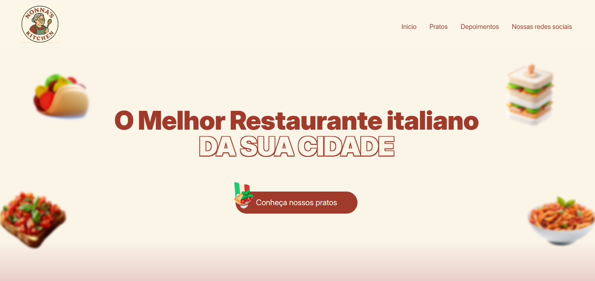
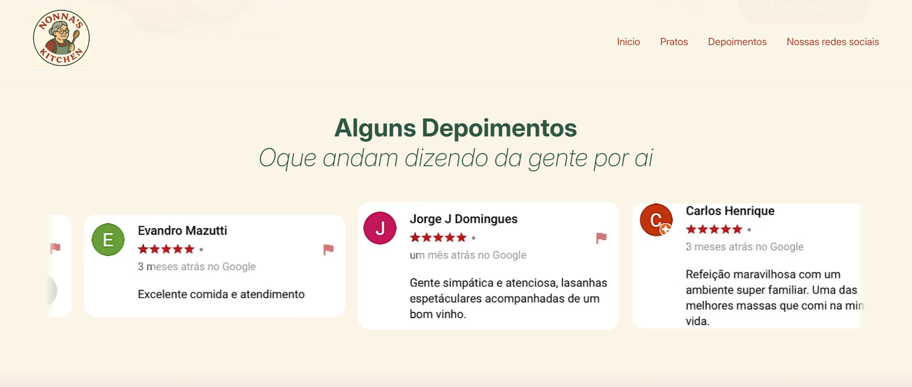
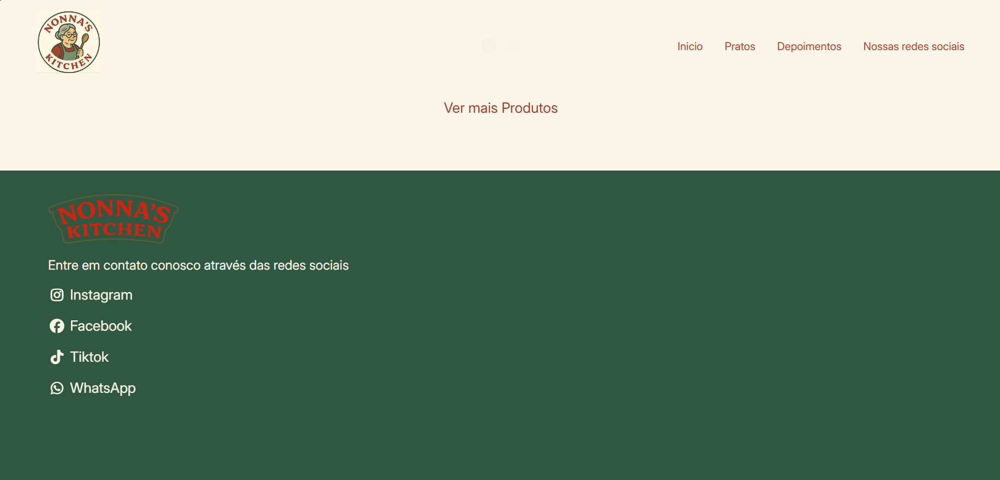
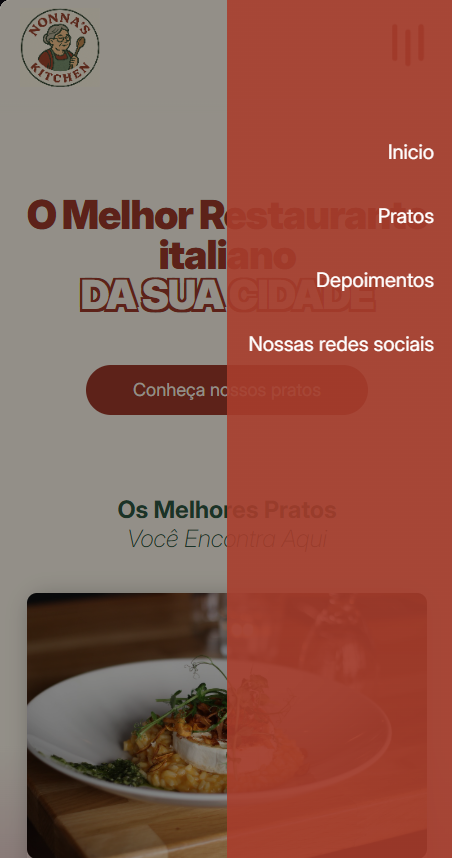
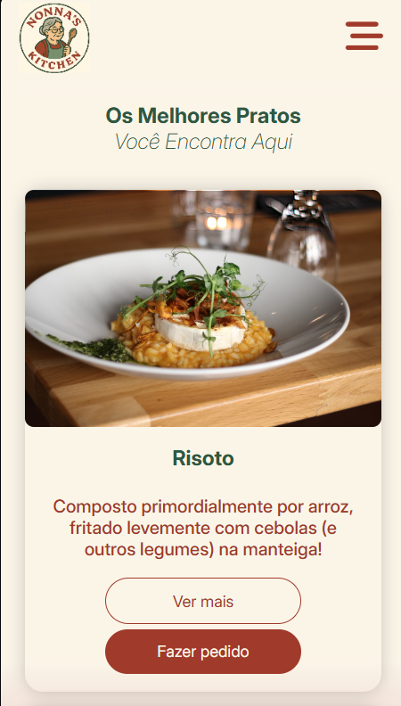

# 📌 About the project

## Us English

Nonna’s Kitchen is a website developed for a fictional Italian restaurant, focusing on modern design, responsiveness, accessibility and good front-end development practices.
The project was created with the aim of composing my portfolio as a Web Developer, demonstrating code organization,
attention to user experience and HTML semantics.

🔗 Demo: https://nonnas-kitchen.netlify.app

# 🎯 Project Objectives

- Create an attractive landing page for an Italian restaurant

- Apply Mobile First concepts

- Ensure responsiveness on different devices

- Use semantic HTML and good accessibility practices

- Structure a clear and scalable project for portfolio

 # 🚀 Features

- Responsive layout (desktop, tablet and mobile)

- Functional navigation menu

- Sections (Hero, About, Menu, Testimonials, Contact)

- Structure prepared for basic SEO

- Clean and modern design

- Focus on accessibility and usability

# 🛠️ Technologies Used

- HTML5 (semantic)

- CSS3

- Flexbox

- CSS variables

- Media Queries

- JavaScript (Vanilla JS)

- Mobile First

- Accessibility (ARIA, good practices)

- Git & GitHub

- Netlify (deploy)

# How to run locally

Use: git clone https://github.com/NatanRBomfim/nonnas-kitchen.git

Then access the project folder: cd nonnas-kitchen

Open the index.html file in the browser

# 📸 Screenshots

### 🖥️ Desktop

### 📱 Mobile

# ♿ Accessibility

- Use of semantic HTML tags

- Structure designed for screen readers

- Clear and intuitive navigation

- Adequate color contrast

# 👨‍💻 Author

Developed by Natan Bomfim

🔗 GitHub: https://github.com/NatanRBomfim

💼 LinkedIn: https://www.linkedin.com/in/natanbomfim/

---

# 📌 Sobre o Projeto

## BR Português
Nonna’s Kitchen é um site desenvolvido para um restaurante italiano fictício, com foco em design moderno, responsividade, acessibilidade e boas práticas de desenvolvimento front-end.
O projeto foi criado com o objetivo de compor meu portfólio como Desenvolvedor Web, demonstrando organização de código, atenção à experiência do usuário e semântica HTML.

🔗 Demo: https://nonnas-kitchen.netlify.app

# 🎯 Objetivos do Projeto

- Criar uma landing page atrativa para um restaurante italiano

- Aplicar conceitos de Mobile First

- Garantir responsividade em diferentes dispositivos

- Utilizar HTML semântico e boas práticas de acessibilidade

- Estruturar um projeto claro e escalável para portfólio
  
# 🚀 Funcionalidades

- Layout responsivo (desktop, tablet e mobile)

- Menu de navegação funcional

- Seções (Hero, Sobre, Cardápio, Depoimentos, Contato)

- Estrutura preparada para SEO básico

- Design limpo e moderno

- Foco em acessibilidade e usabilidade

# 🛠️ Tecnologias Utilizadas

- HTML5 (semântico)

- CSS3

- Flexbox

- Variáveis CSS

- Media Queries

- JavaScript (Vanilla JS)

- Mobile First

- Acessibilidade (ARIA, boas práticas)

- Git & GitHub

- Netlify (deploy)

# Como rodar localmente

Use: git clone https://github.com/NatanRBomfim/nonnas-kitchen.git

Depois acesse a pasta do projeto: cd nonnas-kitchen

Abra o arquivo index.html no navegador

# 📸 Screenshots

### 🖥️ Desktop

### 📱 Mobile

# ♿ Acessibilidade

- Uso de tags HTML semânticas

- Estrutura pensada para leitores de tela

- Navegação clara e intuitiva

- Contraste de cores adequado

# 👨‍💻 Autor

Desenvolvido por Natan Bomfim

🔗 GitHub: https://github.com/NatanRBomfim

💼 LinkedIn: https://www.linkedin.com/in/natanbomfim/

